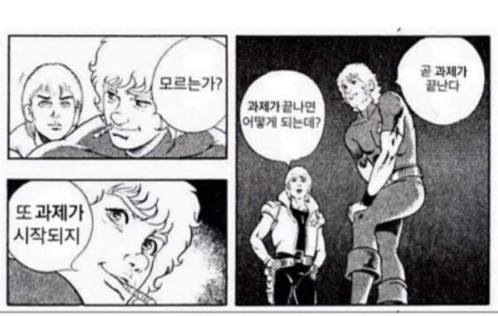

 

나도... 개발자로 일할 수 있을까?

# 개발자의 피, ~~땀,~~ 눈물

- 모험하는 예비 개발자님 안녕하세요! 학원에서 이론 배우시느라 고생 많으셨습니다. 👏
- 여기는 실무에 필요한 javascript 문법을 훈련하는 곳입니다.
- 메일로 안내받으신 분들은 훈련에 참여하고 피드백을 받을 수 있습니다.
- 훈련 기간은 3주(15일) 입니다.
  - 일찍 끝내도 돼요 🙆
  - 늦게 끝내는 건 안 돼요 🙅‍♂️

 

# 무엇을 배우나요?

- github로 동료에게 코드를 공유하는 방법을 자연스럽게 배웁니다.
- 프론트엔드 개발을 위한 필수 문법을 빠르게 익힙니다.
- 강제로 javascript native developer로 개종됩니다.
- 이 과정을 마치면 적어도 문법을 몰라서 고통받는 일은 없을지도 모릅니다.
  - 푸는 모든 과정을 리뷰할 거예요.
  - 어떻게든 되기만 하는 코드를 만드는게 목적이 아닙니다.

 

# 하나씩 준비해요

### repo 준비

- 이 리파지토리를 fork 합니다.
- `javascript/${nickname}` 폴더를 만드세요.

### 백준 가입하기

- [백준](https://www.acmicpc.net/register)에 가입합니다.
- [설정](https://www.acmicpc.net/modify) 으로 이동합니다.
  - 설정 > 언어 > 볼 언어 > node.js (기본언어) 로 설정
  - 나머지 모든 언어 숨김
  - 저장

### Slack 가입하기

- 프로필 사진을 준비합니다.
-  [Slack에 가입하기](https://join.slack.com/t/cddcaresquare-ooc1094/shared_invite/zt-20u4121qb-B6z4a25rQ9kWWygfTZZ3QA)

### 문제 풀기

- [단계별로 풀어보기](https://www.acmicpc.net/step)로 이동해요.
- 하루에 1단계의 모든 문제를 풀어요.
- 문제마다 파일을 만들기 보다는, 함수 이름을 지어주세요.
  - [👀 C#을 훈련 받았던 인턴의 첫 코드 살펴보기  ](https://github.com/EdenKwon/BackJoon/blob/develop/ConsoleApp1/Level1.cs)

### PR 요청하기

- 각 문제를 풀 때마다 commit을 남기세요.
- 첫번째 commit을 만들었다면 가장 먼저 PR을 등록하세요.
  - 아직 작업중이라면 머릿말에 WIP를 붙이세요
  - [wip branch가 뭐죠?](https://stackoverflow.com/questions/15763059/github-what-is-a-wip-branch)
  - lokks307/training-newbie repository로 PR을 요청하시면 됩니다.
  
 

# 모든 단계를 풀면 어떻게 되나요?

- 사전 과제가 주어집니다.
- 마치, 처음인 것처럼 다시 신입 인터뷰를 봅니다.
